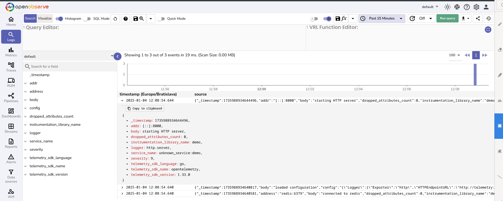
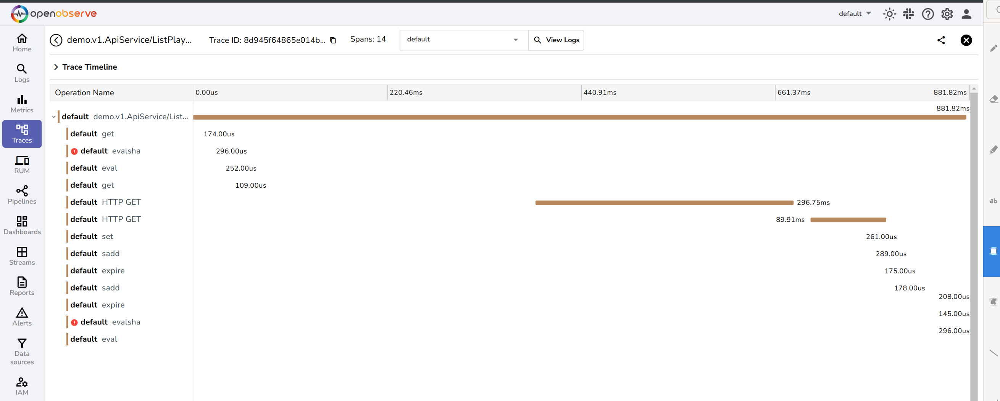
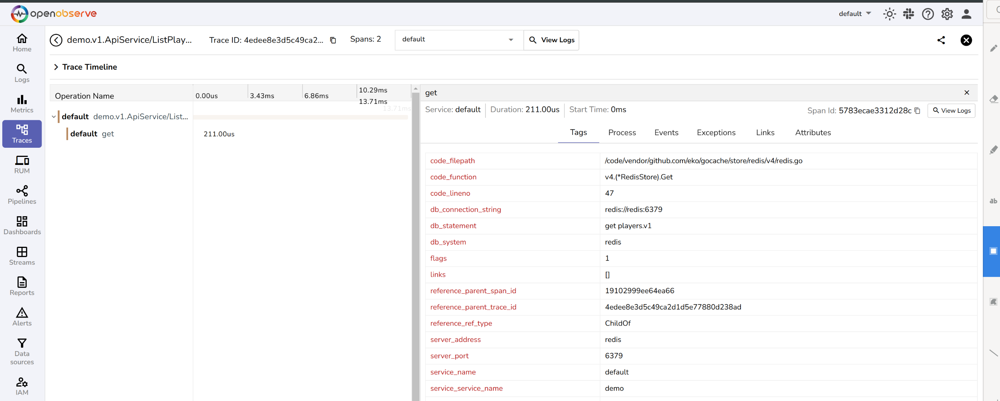
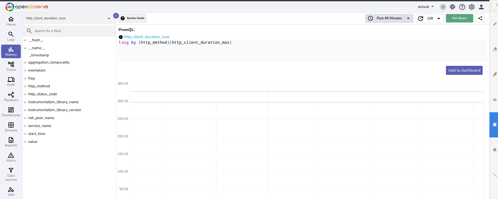
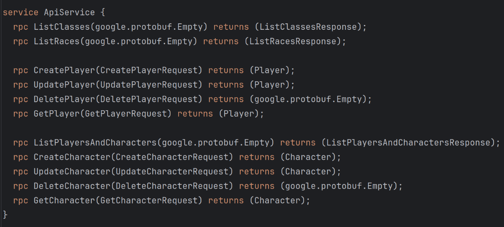
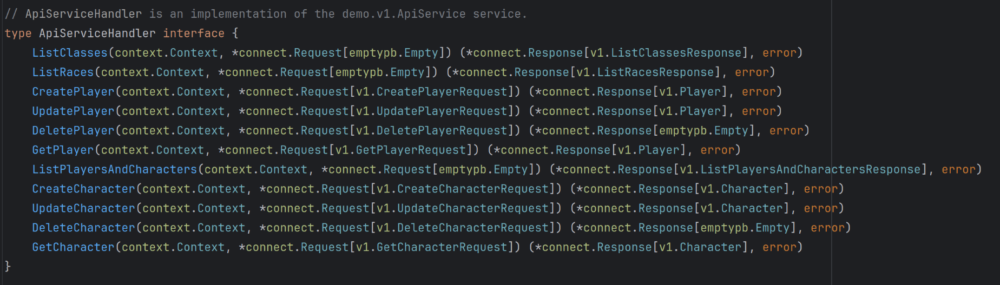
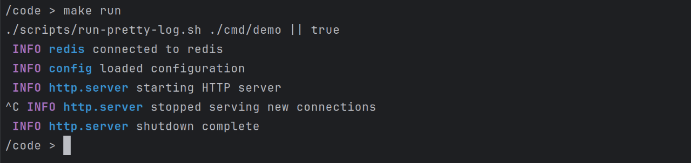
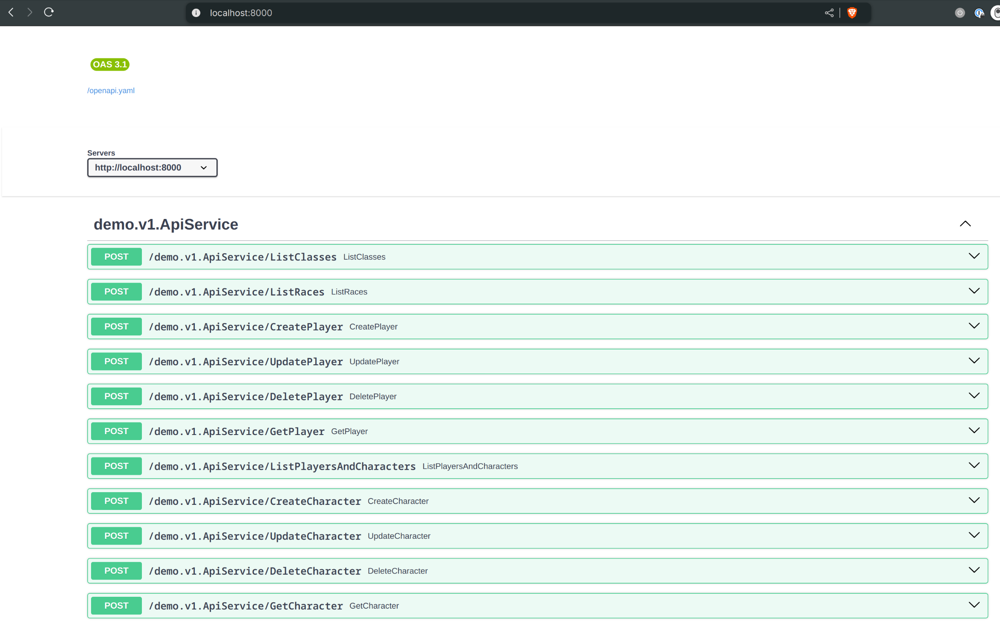
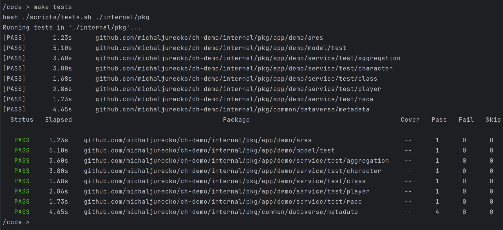

# Sample Go API Backend

This repository contains a sample backend API implemented in Go as part of a job application process.

## Table of Contents

1. [Analysis](#analysis)
    1. [Task Summary](#task-summary)
    2. [Additional Information](#additional-information)
    3. [Microsoft Dataverse Specifics](#microsoft-dataverse-specifics)
2. [Implementation Details](#implementation-details)
    1. [Directory Structure](#directory-structure)
    2. [Docker Containers](#docker-containers)
    3. [Makefile](#makefile)
    4. [Linter](#linter)
    5. [Telemetry](#telemetry)
        - [Logs](#logs)
    6. [Graceful Shutdown](#graceful-shutdown)
    7. [Configuration](#configuration)
    8. [Dependency Management](#dependency-management)
3. [Dataverse Model](#dataverse-model)
    1. [HTTP Client](#http-client)
    2. [Metadata API Client](#metadata-api-client)
    3. [Entity & Repository Generator](#entity--repository-generator)
    4. [Generated Model](#generated-model)
    5. [Testing the Generated Model](#testing-the-generated-model)
4. [API Service](#api-service)
    1. [Protocol Buffers Definition](#protocol-buffers-definition)
    2. [Connect RPC Server](#connect-rpc-server)
        - [Generated Go Server](#generated-go-server)
        - [Generated JS/TS Client](#generated-jsts-client)
5. [Service Implementation](#service-implementation)
    1. [Redis Cache](#redis-cache)
6. [Demo](#demo)
7. [Tests](#tests)
8. [TODO](#todo)
9. [Summary](#summary)


## Analysis

### Task Summary
- **Data is stored in the low-code platform [Microsoft Dataverse](https://learn.microsoft.com/en-us/power-apps/maker/data-platform/data-platform-intro), accessed via [OData Web API](https://learn.microsoft.com/en-us/power-apps/developer/data-platform/webapi/overview).**
- List of tables: `Player`, `Character`, `Class`, `Race`, `DiceRoll`.
- A dedicated endpoint should return all `Players` and their `Characters`, **using a Redis cache**.
- There should be a simple business logic:
  - The **`Player`** fields `VatId` and `Address` should be fetched automatically from the [ARES](https://ares.gov.cz/stranky/vyvojar-info) service.
  - The **`Character`** fields `Strength`, `Dexterity`, `Intelligence`, and `Charisma` are the sum of:
      - User input.
      - Base value from the `Class`.
      - Base value from the `Race`.
      - Random value from the `DiceRoll`. The roll is stored for audit purposes.

### Additional Information
- Development is optimized for a small team of 1–2 Go developers and 1–2 UI developers.
- The backend is consumed primarily by Vue.js UI.
- The solution is tailored for agile development and fast modifications.

### Microsoft Dataverse Specifics
- **No existing Go libraries generate entities from Dataverse/OData models.**
- Quality libraries for this domain primarily exist only for `C#` and `Java`.

-------------------------------------

## Implementation Details

### Directory Structure

The repository follows the recommended [Go project layout](https://github.com/golang-standards/project-layout).

### Docker Containers

Development uses Docker to ensure consistent environments.

- [.devcontainer/Containerfile](./.devcontainer/Containerfile): 
  - `dev` image specification.
- [.devcontainer/compose.yaml](./.devcontainer/compose.yaml): 
  - Defines services:
      - `dev`: 
        - Main DEV container.
        - Run the API server using `make run` and open `http://localhost:8000`.
      - `dev-no-ports`
        - DEV container without exposed ports for IDE integration or test execution.
      - `redis`
        - [Redis](https://redis.io/) cache server.
      - `redisinsight`
		  - [Redis Insight](https://redis.io/insight/) - a UI for Redis.
          - `http://localhost:5540`
      - `telemetry`: 
        - [OpenObserver](https://openobserve.ai/) server - an example telemetry receiver.
        - To process logs, traces, and metrics.
        - `http://localhost:5080`

---------------


### Makefile

Common tasks are defined in the [Makefile](./Makefile):

- `make clean`: Remove all Docker containers.
- `make shell`: Start a shell in the `dev` container.
- Other `Makefile` commands should be executed inside the `dev` container (`make shell`):
	- `make lint`: Code linting.
	- `make fix`: Code linting with automatic fixes.
	- `make test`: Run all tests.
	- `make deps-tidy`: Update `go.mod` and `go.sum`.
	- `make deps-upgrade`: Interactive dependency upgrade.
	- `make gen-model`: Generate Go entities and repositories from the Dataverse model.
	- `make gen-api`: Generate API server and JavaScript client from protobuf definitions.
	- `make gen-wire`: Generate dependency initialization code with [Google Wire](https://github.com/google/wire).
	- `make buf-lint`: Lint protobuf files.
	- `make buf-update`: Update external protobuf files.

### Linter

Code linting uses [GolangCI-Lint](https://golangci-lint.run/), configured in [build/ci/lint.yaml](./build/ci/lint.yaml).

### Telemetry

Telemetry is implemented using [OpenTelemetry](https://opentelemetry.io/):

Logs, traces, and metrics can be sent to various backends.

<details>
<summary>Examples</summary>

_Note: OpenObserver UI is very limited._

Logs:


Cache miss trace:


Cache hit trace:


Metrics:

</details>

#### Logs

- Logs use structured JSON format.
- The [slog](https://go.dev/blog/slog) package from standard library is used.
- Logs are always sent to `stdout`, and optionally also to a remote OpenTelemetry HTTP endpoint.

---------------


### Graceful Shutdown

- The application implements a straightforward approach to graceful shutdown.
- Services must be terminated in reverse order of their creation.
- This simple LIFO stack is implemented by the [shutdown](internal/pkg/common/shutdown) package.
- The main `context` is created in [main.go](cmd/demo/main.go) and can be terminated with `SIGTERM`, triggering a graceful shutdown.
- Examples (`down.OnShutdown(...)`:
  - [HTTP server](internal/pkg/app/demo/server/server.go)
  - [Redis client](internal/pkg/common/redis/redis.go)

---------------

### Configuration

**Application-wide configuration is defined in [internal/pkg/app/demo/config/config.go](internal/pkg/app/demo/config/config.go).**
- Each component/package has its own configuration structure.
- It encourages single responsibility principle.
- Each part is independently testable.
- All partial configurations combine into the application configuration.
- Configuration can be set using ENVs or CLI flags.

Partial configurations:
- Logger: [internal/pkg/common/log/config/config.go](internal/pkg/common/log/config/config.go)
- Telemetry: [internal/pkg/common/telemetry/config/config.go](internal/pkg/common/telemetry/config/config.go)
- Dataverse Web API: [internal/pkg/common/dataverse/webapi/config.go](internal/pkg/common/dataverse/webapi/config.go)
- Server: [internal/pkg/app/demo/server/config/config.go](internal/pkg/app/demo/server/config/config.go)
- Redis: [internal/pkg/common/cache/redis/config.go](internal/pkg/common/cache/redis/config.go)

Run `go run ./cmd/demo --help` to see all available options:
<details>
<summary>Output</summary>

```txt
Usage: demo [flags]

Note: Each flag can be set as an ENV.

Flags:
  -h, --help                      Show context-sensitive help.
      --logger-exporter="none"    Type of log exporter, one of [ none, http ]
                                  ($DEMO_LOGGER_EXPORTER).
      --logger-http-endpoint-url="http://localhost:4318/v1/logs"
                                  Endpoint URL for log exporter
                                  ($DEMO_LOGGER_HTTP_ENDPOINT_URL).
      --logger-http-authorization="Basic ...."
                                  Authorization for log exporter
                                  ($DEMO_LOGGER_HTTP_AUTHORIZATION).
      --telemetry-trace-exporter="none"
                                  Type of telemetry trace exporter, one of [
                                  none, http ] ($DEMO_TELEMETRY_TRACE_EXPORTER).
      --telemetry-trace-http-endpoint-url="http://localhost:4318/v1/traces"
                                  Endpoint URL for HTTP traces exporter
                                  ($DEMO_TELEMETRY_TRACE_HTTP_ENDPOINT_URL).
      --telemetry-trace-http-authorization="Basic ...."
                                  Authorization for traces exporter
                                  ($DEMO_TELEMETRY_TRACE_HTTP_AUTHORIZATION).
      --telemetry-metric-exporter="none"
                                  Type of telemetry metric exporter,
                                  one of [ none, http ]
                                  ($DEMO_TELEMETRY_METRIC_EXPORTER).
      --telemetry-metric-http-endpoint-url="http://localhost:4318/v1/metrics"
                                  Endpoint URL for HTTP metrics exporter
                                  ($DEMO_TELEMETRY_METRIC_HTTP_ENDPOINT_URL).
      --telemetry-metric-http-authorization="Basic ...."
                                  Authorization for metrics exporter
                                  ($DEMO_TELEMETRY_METRIC_HTTP_AUTHORIZATION).
      --server-listen-address="0.0.0.0:8000"
                                  Listen address of API HTTP server
                                  ($DEMO_SERVER_LISTEN_ADDRESS).
      --model-tenant-id=STRING    ($DEMO_MODEL_TENANT_ID)
      --model-client-id=STRING    ($DEMO_MODEL_CLIENT_ID)
      --model-client-secret=STRING
                                  ($DEMO_MODEL_CLIENT_SECRET)
      --model-api-host=STRING     ($DEMO_MODEL_API_HOST)
      --model-debug-request       ($DEMO_MODEL_DEBUG_REQUEST)
      --model-debug-response      ($DEMO_MODEL_DEBUG_RESPONSE)
      --redis-address=STRING      ($DEMO_REDIS_ADDRESS)
      --redis-username=STRING     ($DEMO_REDIS_USERNAME)
      --redis-password=STRING     ($DEMO_REDIS_PASSWORD)
      --redis-db=0                ($DEMO_REDIS_DB)
```
</details>

---------------


### Dependency Management

Dependency management in Go usually avoids "magic" frameworks.
- Dependencies are parameters to a constructor or a provider function.
- **This project uses [Google Wire](https://github.com/google/wire) to automate service wiring.**

Example:
- [ares.NewClient](internal/pkg/app/demo/ares/ares.go) depends on `*http.Client`, and it is provided by [httpclient.New](internal/pkg/common/httpclient/httpclient.go).
  - The [wire.go](internal/pkg/common/httpclient/wire.go) in the `httpclient` package defines `var WireSet = wire.NewSet(New)`.
  - It means, we should use the `New` function to create `*http.Client`.
- All application dependencies are defined in [internal/pkg/app/demo/cmd/wire.go](internal/pkg/app/demo/cmd/wire.go).
  - It includes `httpclient.WireSet` and `ares.NewClient` from the example above.
- Command `make gen-wire` generates [wire_gen.go](internal/pkg/app/demo/cmd/wire_gen.go) composing all dependencies together.
- A different initialization code can be generated for tests, using some mocked services.

---------------

### Dataverse Model

**The main challenge was integrating the Dataverse low-code model with Go.**

#### HTTP Client

A simple HTTP client has been composed to interact with the Dataverse Web API.  
- See the [dataverse/webapi](internal/pkg/common/dataverse/webapi/client.go) package.
- OAuth2 authorization is handled transparently by the [golang.org/x/oauth2](https://pkg.go.dev/golang.org/x/oauth2).

#### Metadata API Client

A simple Metadata API client has been created to fetch entity metadata.  
- See the [dataverse/metadata](internal/pkg/common/dataverse/metadata/metadata.go) package.
- It fetches custom `tables` and their `columns`.

#### Entity & Repository Generator❗

Dataverse metadata is used in a custom code generator.
- The main part of the generator logic is in [dataverse/entitygen/entity.go](internal/pkg/common/dataverse/entitygen/entity.go).
- It generates Go structures representing individual tables / entities.
- It also generates a repository with methods like `Create`, `Update`, `Delete`, `ById`, and others.
- For example, the `fields` method generates the struct fields.
- Similarly, the `createMethod` generates the `Create` method in the Repository.
- **It is not necessary to study the code generator in detail.**
- **See the examples of generated code below.**

#### Generated Model

Code has been generated using `make gen-model`.

Generated code is committed to the repository:
- [player.go](internal/pkg/app/demo/model/gen/player.go)
- [character.go](internal/pkg/app/demo/model/gen/character.go)
- [class.go](internal/pkg/app/demo/model/gen/class.go)
- [race.go](internal/pkg/app/demo/model/gen/race.go)
- [diceroll.go](internal/pkg/app/demo/model/gen/diceroll.go)

Features:
- [webapi.Lookup[T]](internal/pkg/common/dataverse/webapi/lookup.go) represents foreign key references.
- [webapi.ChangeSet](internal/pkg/common/dataverse/webapi/changeset.go) supports batching multiple changes atomically❗
- `<entity>.TrackChanges` method provides changes tracking
  - `PATCH` updates contain changed fields only❗
- Use ENVs below to log request / response details to `stdout`.
  - `DEMO_MODEL_DEBUG_REQUEST=true`
  - `DEMO_MODEL_DEBUG_RESPONSE=true`

#### Testing the Generated Model

Functionality of generated code was validated with a test:  
- See [internal/pkg/app/demo/model/test/model_test.go](internal/pkg/app/demo/model/test/model_test.go).

Further examples are demonstrated in the API Service section below.

---------

### API Service

#### Protocol Buffers Definition

- The API service is defined using [Protocol Buffers](https://protobuf.dev/) `.proto` files:
	- [api/proto/demo/v1/api.proto](api/proto/demo/v1/api.proto)
	- [api/proto/demo/v1/validate.proto](api/proto/demo/v1/validate.proto)
- The API model is distinct from the Dataverse model, as they are not and will never be 1:1.
- Validation rules are included in the definition using [bufbuild/protovalidate](https://github.com/bufbuild/protovalidate). 



**Advantages**
- The syntax is concise and allows for easy modifications.
- Works well with AI due to its limited DSL nature, reducing potential errors, simplifying code review.
- Protocol Buffers language is a Google-developed standard with long-term stability.

**Alternatives**
- [Goa Design](https://goa.design/)
- [AWS Smithy](https://smithy.io/2.0/index.html)
- [GraphQL](https://graphql.org/)


-------------

#### Connect RPC Server

- There are several ways to generate a server from the `proto` service definition.
- I chosen [ConnectRPC](https://connectrpc.com/).
- The code is generated using `make gen-api`. 

**Advantages**
- Fewer layers compared to alternatives.
- Part of the [Cloud Native Computing Foundation](https://www.cncf.io/projects/connect-rpc/).
- Utilizes many components from Go's standard library, ensuring higher reliability.
- Built on HTTP, without requiring HTTP/2, making browser calls straightforward.

**Things that can surprise**
- All requests use HTTP `POST` method.
- Connect RPC does not seek to be compatible with REST standards and OpenAPI.
- And hence its simplicity, for examples fields are not separated between `query` and `body`.
- These are advantages, especially in our case, when the API is directly consumed by the UI.

**Alternatives**
- [gRPC](https://grpc.io/) 
  - More suitable for communication between microservices
  - Requires HTTP/2.
- [gRPC](https://grpc.io/) + [gRPC-Gateway](https://grpc-ecosystem.github.io/grpc-gateway/)
  - Allows for RESTful API generation from gRPC definitions.
  - More complex, requires more components.

**Comparison: Connect RPC vs gRPC-Gateway**

- If necessary, the definitions can be easily supplemented..
- Result will be a REST API according standards.
- But it's (unnecessarily) more work.

Connect RPC example:
```proto
rpc UpdatePlayer(UpdatePlayerRequest) returns (Player);
```

gRPC-Gateway example:
```proto
rpc UpdatePlayer(UpdatePlayerRequest) returns (Player) {
    option (google.api.http) = {
      patch: "/player/{id}"
      body: "*"
    };
};
```

##### Generated Go Server

- A Go server is generated based on the `.proto` files mentioned above.
	- Example generated code: [api/gen/go/demo/v1/apiconnect/api.connect.go](api/gen/go/demo/v1/apiconnect/api.connect.go)
	- The key part is the `ApiServiceHandler` interface, which must be implemented by us.
	- The rest is managed by the generated code.



##### Generated JS/TS Client

- A JS/TS client for the web is also generated from the same definitions❗
	- Example generated code: [api/gen/ts/demo/v1/api_pb.ts](api/gen/ts/demo/v1/api_pb.ts)
- Integration with [Connect Query](https://github.com/connectrpc/connect-query-es) for [TanStack Query](https://tanstack.com/query/latest) can also be generated:
	- TanStack Query is `asynchronous state management for TS/JS, React, Solid, Vue, Svelte, and Angular`.

---------------

### Service Implementation

The **[mapper](internal/pkg/app/demo/service/mapper)** package provides mapping between Dataverse entities and API models:
- [player.go](internal/pkg/app/demo/service/mapper/player.go)
- [character.go](internal/pkg/app/demo/service/mapper/character.go)
- [class.go](internal/pkg/app/demo/service/mapper/class.go)
- [race.go](internal/pkg/app/demo/service/mapper/race.go)
- [aggregated.go](internal/pkg/app/demo/service/mapper/aggregated.go)

The **[service](internal/pkg/app/demo/service)** package implements service methods:
- [player.go](internal/pkg/app/demo/service/player.go)
- [character.go](internal/pkg/app/demo/service/character.go)
- [class.go](internal/pkg/app/demo/service/class.go)
- [race.go](internal/pkg/app/demo/service/race.go)
- [aggregated.go](internal/pkg/app/demo/service/aggregated.go)

The **[playerbiz](internal/pkg/app/demo/biz/playerbiz)** package implements player business logic:
- [player.go](internal/pkg/app/demo/biz/playerbiz/player.go)

The **[characterbiz](internal/pkg/app/demo/biz/characterbiz)** package implements character business logic:
- [character.go](internal/pkg/app/demo/biz/characterbiz/character.go)

 
#### Redis Cache

- Results of the `ListPlayersAndCharacters` method are cached in Redis.
- API responses are cached directly, not entities from Dataverse, in this use-case it doesn't really matter.
- Cache is invalidated using `tags`, when any `Player` or `Character` is updated.

---------------

### Demo

How to try the application.

1. Clone repo: `git clone https://github.com/michaljurecko/api-demo.git`
2. Open directory: `cd api-demo`
3. Copy `env.example` to `env.local`: `cp env.example env.local`
4. Edit `env.local` and set the following variables:
   - `DEMO_MODEL_TENANT_ID=...`
   - `DEMO_MODEL_CLIENT_ID=...`
   - `DEMO_MODEL_CLIENT_SECRET=...`
   - `DEMO_MODEL_API_HOST=...`
5. _Optionally_, enable export of logs, traces and metrics to [OpenObserve](https://openobserve.ai/):
   - Set the following variables:
     - `DEMO_LOGGER_EXPORTER=http`
     - `DEMO_TELEMETRY_TRACE_EXPORTER=http`
     - `DEMO_TELEMETRY_METRIC_EXPORTER=http`
     - `DEMO_LOGGER_HTTP_AUTHORIZATION="Basic <token>"`
     - `DEMO_TELEMETRY_TRACE_HTTP_AUTHORIZATION="Basic <token>"`
     - `DEMO_TELEMETRY_METRIC_HTTP_AUTHORIZATION="Basic <token>"`
   - Start [OpenObserve](https://openobserve.ai/) container:
     - `docker compose -f .devcontainer/compose.yaml up -d telemetry`
   - Open http://localhost:5080/web/ingestion/custom/logs/otel
     - Copy the token, and use it as the `<token>` placeholder in the variables above.
6. Run `dev` container: `make shell`
7. In the `dev` container, start the server: `make run`
   - If you want raw logs with all details, you can use `make run-raw` instead.
   - The [graceful shutdown](#graceful-shutdown) can be triggered by `Ctrl+C` (`SIGTERM`).
8. The server is running at `http://localhost:8000`.
   - The root endpoint `/` contains interactive OpenAPI documentation for easy testing.
   - All endpoints use HTTP `POST` method, read [Things that can surprise](#things-that-can-surprise).





-----------

### Tests

To run all unit and E2E tests, execute `make tests`.

E2E tests are implemented using [ginkgo](https://github.com/onsi/ginkgo).
- The [server](internal/pkg/app/demo/service/test/server.go) is launched on a random port during tests.
  - It provides true end-to-end testing.
- Requests are executed using the generated Go client.
- [Player tests](internal/pkg/app/demo/service/test/player/player_test.go)
- [Character tests](internal/pkg/app/demo/service/test/character/character_test.go)
- [Class tests](internal/pkg/app/demo/service/test/class/class_test.go)
- [Race tests](internal/pkg/app/demo/service/test/race/race_test.go)
- [Aggregation tests](internal/pkg/app/demo/service/test/aggregation/aggregation_test.go) - test Redis cache invalidation



---------------


### TODO

- The Dataverse model does not define alternate keys on `<entity>.name`.
  - So in some places, all entities are iterated in a `for` loop.
  - I did not modify the model, as stated in the assignment.
- Authentication and authorization were not addressed 
  - Both would be implemented as middleware in the API server.
- Rate limiting and retry logic were not addressed.
- Cascading deletion for `Player` -> `Character` -> `DiceRoll` was not implemented.

---------

### Summary

- Implementation took approximately 5MD.
- Most time was spent on Dataverse: studying and creating the code generator.
- Significant effort went into selecting technologies for the API.
- The solution is designed for rapid development and straightforward testing.
- Manual work was minimized, and definitions can be easily updated with AI assistance.
- Seamless integration with the UI is ensured through the generated JS client.


